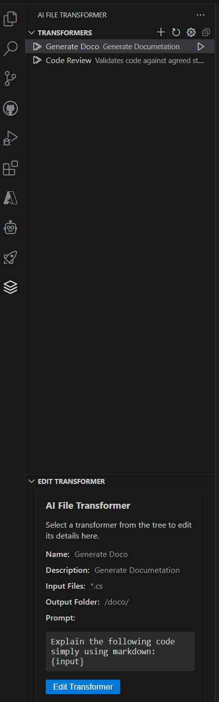

# VS Code 'Fuzor-AI Transformer' Extension

The **VS Code 'Fuzor-AI Transformer' Extension** is a powerful extension that enables AI-powered file transformations directly within Visual Studio Code. This Extension provides a customisable interface for processing files using various AI models, making it easy to automate complex workflows and enhance productivity.

This allows for saving, and maintaining of advanced prompts and templates, as well as the ability to work with files directly - instead of having to copy/paste with a chat interface.

## Features

- **Multiple AI Model Support**: Choose from OpenAI or other modesl
- **Customisable Transformers**: Create and manage transformers with:
  - Wildcard file matching
  - Custom prompt templates with placeholder support
  - Configurable output file naming and structure
  - Create, duplicate, edit, and delete transformers
  - Browse and import transformers from online library (planned feature)

## Use Cases

The VS Code 'Fuzor-AI Transformer' Extension can be used for various scenarios, including:

1. **Source Code Documentation**:
   - Automatically generate documentation for code files
   - Create API references from source code
   - Generate inline comments for complex functions

2. **Code Refactoring**:
   - Automate code style improvements
   - Convert code between different patterns or paradigms
   - Optimise code for performance or readability

3. **Code Conversions**:
   - Convert from one language to another

4. **Data Transformation**:
   - Convert between different data formats (JSON, XML, CSV)
   - Normalise data structures
   - Generate sample data from schemas

5. **Localisation**:
   - Translate documentation and UI strings
   - Generate localised versions of code comments
   - Create multilingual documentation sets

6. **Testing**
    - Generate unit tests for files / folders
    - Generate test automations

## [Design](design.md)

## Installation from Package
1. Download from the github packages.
2. In VS Code add the extention directly using the "install from VSIX"
4. Configure your API keys in the settings:
   - Open VS Code settings
   - Navigate to "'Fuzor-AI Transformer'" section
   - Enter API keys for your preferred AI providers
5. Create your first transformer using the UI or via the command palette (`Ctrl+Shift+P` -> "Create Transformer")
6. Configure:
   - Input file patterns (e.g., `*.txt`, `src/**/*.js`)
   - AI prompt template
   - Output file naming and location
7. Run the transformer and view results in the output panel

## Installation from Source

1. Reference how to develop extensions here - https://code.visualstudio.com/api
2. Install node.js and git
3. Clone repository
4. `npm install`
5. `cd webview-ui && npm install`
6. `cd webview-ui && npm start`
7. Run the extension after this. It automatically watches for changes in webview-ui
8. You can install the Extension Test Runner extention, and run tests in vscode, or use `npm test`

## Roadmap

- Online transformer library for sharing and discovering transformers
- Integration with additional AI providers
- Advanced error handling and retry mechanisms
- And more..

## Contributing

We welcome contributions! Please follow these steps:

1. Fork the repository
2. Create a new branch for your feature/bugfix
3. Submit a pull request with detailed description of changes

## License

This project is licensed under the MIT License - see the [LICENSE](LICENSE) file for details.
